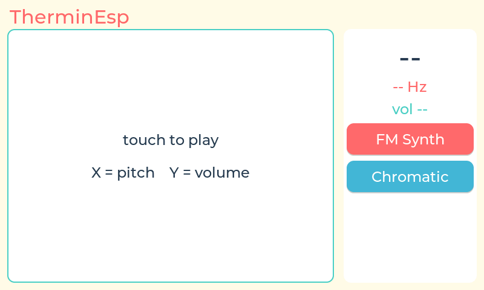

# TherminEsp 🎵👋

**A visual theremin that runs entirely on one chip.** Wave your hand in front of the camera and the ESP32-S31 sees it, tracks it with an on-device neural network, and synthesizes music in real time — no computer, no cloud, no browser. Touch the screen and it's a playable instrument too.

TherminEsp is the fully-embedded successor to [Wavr](https://github.com/MarioCruz/Wavr), my browser-based visual theremin (MediaPipe + Web Audio on a Raspberry Pi 5). Everything Wavr did across a Pi, Chromium, and a webcam now happens inside a single microcontroller.



*The instrument's screen, captured remotely from the running board — the firmware reads the RGB panel's framebuffer and streams it over serial (`CONFIG_THEREMIN_BOOT_SCREENSHOT`).*

| | Wavr (Pi 5) | TherminEsp (ESP32-S31) |
|---|---|---|
| Hand tracking | MediaPipe Hands, in-browser JS | **espdet-pico neural net, on-chip** (~95 ms/frame) |
| Audio synthesis | Web Audio API | **Custom C DSP engine → I2S codec** (48 kHz stereo) |
| Display | Browser tab | **800×480 touchscreen, LVGL** |
| Computer required | Raspberry Pi 5 + Chromium | **None** |

## Hardware

Runs on the **ESP32-S31-Korvo-1** dev board — everything needed is on it:

- **ESP32-S31** — dual-core RISC-V @ 320 MHz + LP core, Wi-Fi 6, BT 5.4, 802.15.4, hardware JPEG codec (chip hit mass production July 2026; this project runs on rev v0.0 silicon)
- 16 MB flash + 16 MB octal PSRAM @ 250 MHz
- **OV3660 camera** on the DVP interface (720p JPEG @ 17 fps)
- **800×480 RGB LCD** with GT1151 capacitive touch
- **ES8389 audio codec** — 48 kHz 16-bit stereo I2S, speakers + mics
- WS2812 status LED, 4 ADC buttons, SD slot

## How you play

| Gesture | Controls | Mapping |
|---|---|---|
| Hand left ↔ right | **Pitch** | C2 (65 Hz) → C6 (1047 Hz), log-mapped, quantized to the selected scale |
| Hand up ↕ down | **Volume** | Up = loud, down = quiet |
| Fist ✊ / open hand ✋ | **Filter** | Bounding-box area drives a lowpass sweep, 200 Hz → 8 kHz |
| No hand | Silence | 4-frame hysteresis so the note doesn't stutter |
| **Touchscreen** | Same pitch/volume | X = pitch, Y = volume — works even with the camera covered |

On-screen: live note name, frequency, volume, a marker that follows your hand, plus buttons to cycle through **7 synth modes** and **10 musical scales**. The status LED shifts from coral to sky-blue as pitch rises (Beach Boys palette, carried over from Wavr).

## Architecture

```
            ┌───────────────────────── ESP32-S31 ─────────────────────────┐
 OV3660     │                                                             │
 camera ──▶ │  Core 0                          Core 1                     │
 (720p      │  ├─ camera task (V4L2 dequeue)   ├─ synth task (prio MAX-3) │
  JPEG,     │  ├─ LVGL / touch / UI            │    7 modes · 10 scales   │
  17 fps)   │  └─ latest-frame mailbox ──────▶ │    biquad filter · glide │
            │                                  │    48 kHz blocks ──▶ I2S │──▶ ES8389 ──▶ 🔊
            │       tracker task (prio 5, core 1)                         │
            │       HW JPEG decode → RGB888 → 224×224 downscale           │
            │       → espdet-pico inference (~95 ms)                      │
            │       → EMA smoothing + hysteresis                          │
            │       → pitch / volume / filter → synth voice               │
            └─────────────────────────────────────────────────────────────┘
```

### The synth engine (`main/synth.c`)

A sample-accurate C port of Wavr's Web Audio graph. Phase-accumulator oscillators render 5 ms blocks at 48 kHz; a blocking codec write paces the loop off the I2S DMA clock.

- **FM Synth** — sine carrier, 2× modulator, index tracks pitch (the classic electro-theremin)
- **Clean Wave** — pure sine
- **Warm Tone** — triangle + 150 ms feedback delay with soft-clip (stands in for Web Audio's compressor)
- **Pad** — three detuned oscillators (±0.5%)
- **Theremin** — sine with 5.5 Hz vibrato scaled to pitch
- **Organ** — additive 1st + 2nd + 3rd harmonics
- **Bitcrush** — sawtooth through an 8-step staircase quantizer

All modes share an RBJ lowpass biquad (Q=2) for the fist/open filter, linear parameter ramps to prevent clicks, scale quantization across 3 octaves, and glide (portamento). A boot self-test sweeps every mode C2→C6 through the codec — if you have speakers connected you get a little demo at every power-on.

### The hand tracker (`main/tracker.cpp`)

- Espressif's **[hand_detect](https://components.espressif.com/components/espressif/hand_detect)** component (espdet-pico, 224×224 input) via **ESP-DL** — the S31 runs the RISC-V (P4) model at ~95 ms/inference, 7–8 fps
- Camera JPEG → **S31 hardware JPEG decoder** straight to RGB888 → nearest-neighbor downscale with a vertical flip (the camera module mounts upside down)
- EMA smoothing (α=0.5) on position and openness; mirrored X so moving right raises pitch
- **Built-in model self-test**: at boot the detector runs on an embedded known-good photo of two hands ([source: Wikimedia Commons, "Human-Hands-Front-Back.jpg"](https://commons.wikimedia.org/wiki/File:Human-Hands-Front-Back.jpg)) and logs the score — instantly separates "model broken" from "camera image bad" forever after

## Building it

You need **ESP-IDF v6.1-beta1** (the ESP32-S31 is a `--preview` target — MicroPython and Arduino don't support this chip yet, as of Aug 2026) and the **esp-dev-kits** repo checked out as a sibling for the Korvo board-support package:

```
GitHub/
├── TherminEsp/                  ← this repo
└── ESPressif/
    └── esp-dev-kits/            ← provides the esp32_s31_korvo BSP
```

```bash
source <idf-install>/activate_idf_v6.1-beta1.sh
cd TherminEsp
idf.py --preview set-target esp32s31
idf.py build
idf.py -p /dev/cu.usbserial-110 flash monitor
```

The first build downloads the managed components (ESP-DL, hand_detect, LVGL, esp_video, esp_codec_dev, …). The hand-detection model is embedded in the app image — which is why `partitions.csv` gives the factory app **8 MB**.

## Project structure

```
main/
├── main.c            boot sequence + synth self-test
├── synth.c/.h        the 7-mode DSP engine (port of Wavr's audio-engine.js)
├── tracker.cpp/.h    JPEG decode → espdet-pico → gesture mapping
├── camera.c/.h       V4L2 capture task (RGB565 probe, 720p JPEG fallback)
├── ui.c/.h           LVGL touchscreen UI + hidden camera debug view
└── testhand_224.rgb  embedded model self-test image
```

## Hard-won lessons (read before hacking)

Things this board taught me the hard way — each one cost a debug cycle:

1. **The DVP driver rejects small RGB565 modes.** `CONFIG_CAMERA_OV3660_DVP_RGB565_BE_240X240_24FPS` exists in Kconfig, but esp-video refuses it at S_FMT (`input width=240, height=240 is not supported`). 1280×720 JPEG is the only mode that streams — decode it with the S31's hardware JPEG engine (it's fast).
2. **The HW JPEG decoder's RGB565 output is byte-swapped** relative to little-endian `uint16_t` reads (this board's pipeline is RGB565_BE end-to-end). Symptom: psychedelic rainbow contours. Fix: decode straight to `JPEG_DECODE_OUT_FORMAT_RGB888` and skip the ambiguity.
3. **The camera mounts upside down** and the V4L2 flip controls are stubbed on this BSP — flip in software.
4. **hand_detect officially supports the S31** even though its README table only lists S3/P4 — the component's CMakeLists maps `esp32s31` to the P4 model. Measured ~95 ms/inference.
5. **The model in flash rodata pushes the app past 4 MB** — grow the factory partition (16 MB flash, use it).
6. **Wi-Fi doesn't fit** in internal RAM alongside camera + LVGL on this chip today (same wall the previous firmware on this board hit) — hence the LCD-native UI instead of a web dashboard.
7. **IDF's C++ flags (`gnu++26 -Werror`)** reject partially-designated initializers on driver config structs — `= {}` then assign fields.
8. **Embed a known-good test input for any on-device ML.** The boot self-test (2 hands @ 0.92 on the reference photo) turns "why doesn't it detect?" from a mystery into a one-line answer: it's your camera image, not the model.
9. **Remote screenshots without a debugger:** `lv_snapshot_take()` deadlocks against the esp_lvgl_adapter's render task — read the RGB panel's framebuffers directly instead (`esp_lcd_rgb_panel_get_frame_buffer`). With triple buffering, dump all three and keep the complete one; base64 over the console UART is slow (~90 s/frame at 115200) but needs zero extra hardware. Enable with `CONFIG_THEREMIN_BOOT_SCREENSHOT` in menuconfig.

## Status

- ✅ Synth engine — all 7 modes verified on hardware, every boot
- ✅ Touch play — the screen is a playable instrument
- ✅ Camera → decode → inference pipeline — 8 fps steady, model self-test passes at 0.92
- 🔧 **Live hand detection** — blocked on physical camera image quality (lens focus + scene lighting); tap the **TherminEsp title** on screen to toggle a live view of exactly what the detector sees while you adjust the lens
- 🔜 Openness-range tuning, multi-hand duet (the detector already returns multiple boxes)

## Credits

- [Wavr](https://github.com/MarioCruz/Wavr) — the original browser theremin this ports
- Espressif's [ESP-DL](https://github.com/espressif/esp-dl), [hand_detect](https://components.espressif.com/components/espressif/hand_detect), [esp-video](https://components.espressif.com/components/espressif/esp_video), and the ESP32-S31-Korvo BSP from [esp-dev-kits](https://github.com/espressif/esp-dev-kits)
- Test image: ["Human-Hands-Front-Back.jpg"](https://commons.wikimedia.org/wiki/File:Human-Hands-Front-Back.jpg) via Wikimedia Commons (public domain, by Evan-Amos)
- Built with [Claude Code](https://claude.com/claude-code) — Claude helped integrate Espressif's [hand_detect](https://components.espressif.com/components/espressif/hand_detect) component: confirming ESP32-S31 support (the component's CMake maps the S31 to its RISC-V/P4 model even though the docs don't list it), wiring the espdet-pico detector into the camera pipeline, and adding the embedded-image model self-test that proved the neural net runs correctly on this chip
